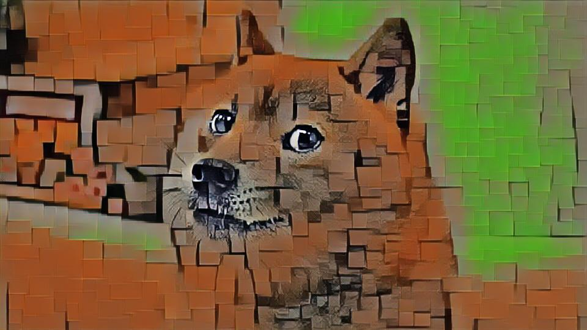

# pytorch-conditional-instance-normalization-style-transfer
Most of this repo's core parameter and code architecture follows from
1. https://github.com/pytorch/examples/tree/master/fast_neural_style
2. https://github.com/kewellcjj/pytorch-multiple-style-transfer
3. https://github.com/Aftaab99/pytorch-multiple-style-transfer

  
  
  
  
  
  
  
  
  
  
  
  
  
  
  
  

To Do List:
- [ ] Multi-GPU Version's Code
- [ ] User Friendly Function Call

I want to do some extensions:
- [ ] Local Instance Normalization 
- [ ] Filter Pruning Exerise (Base on gamma*Filter's F1 Norm)
